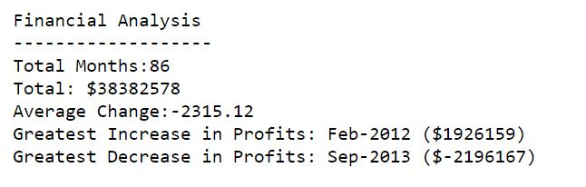
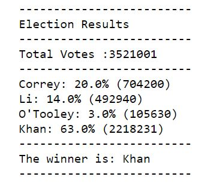

# python-challenge

**PyBank**

Used Python to parsed through data from [Budget Data](PyBank/Resources/budget_data.csv). I used a for loop to calculate the profit change from month to month. A budget analysis report is genearted at the end in a text file.

Screenshot of budget report:

**PyPoll**

Used Python to parsed through data from [Poll Data](PyBank/Resources/election_data.csv). I used a python to generate ratios for candidates and the winning candidate in poll data. An elections result text file is produced at the end.

Screenshot of election results:

